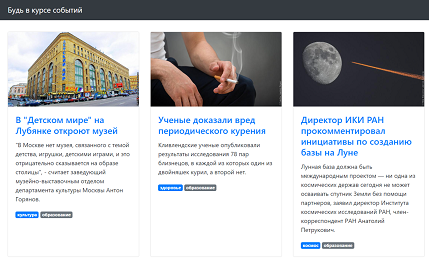
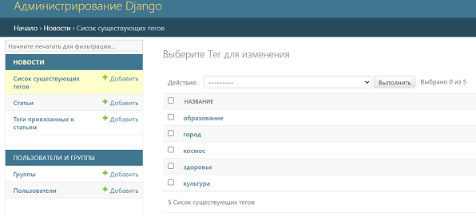
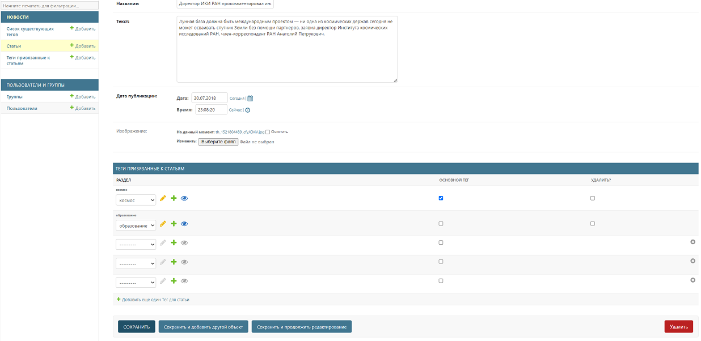
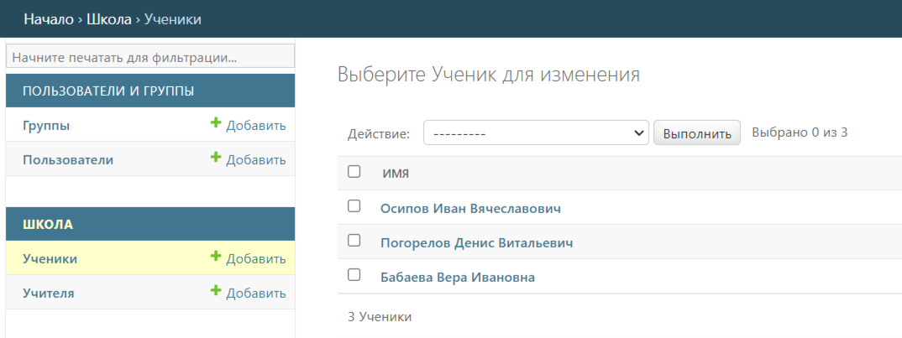
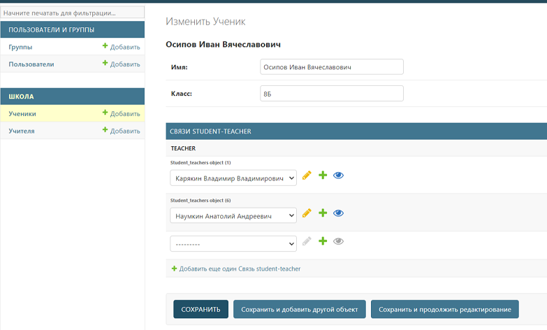
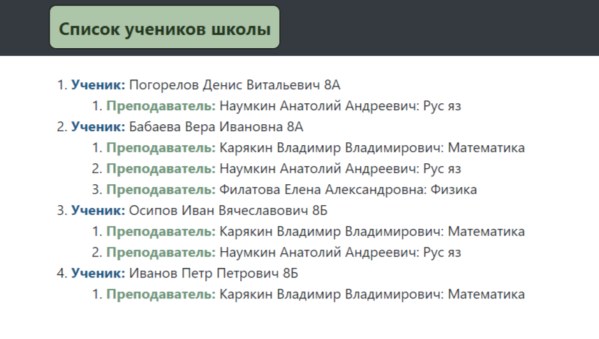

# Домашнее задание "Работа с ORM, часть-2"

## Порядок работы

1. В файл [password.ini](password.ini) необходимо вставить 
`имя пользователя` и `пароль` для работы в `postgresql`. При желании эти данные 
можно ввести в соответствующие поля в файлах  
[settings.py](orm_migrations%2Fwebsite%2Fsettings.py) или 
[settings.py](m2m-relations%2Fwebsite%2Fsettings.py) соответствующего задания.
Сделано это для удобства, чтобы вставить эти данные один раз.

## Задание `m2m-relations`

1. Необходимо записать в БД структуру таблицы и заполнить ее данными. 
Для этого в терминале необходимо последовательно выполнить команды
   * `python manage.py makemigrations`
   * `python manage.py migrate`
   * `python manage.py loaddata articles.json`
2. Далее запускаем приложение командой `python manage.py runserver`. 
В браузере должна появиться страница по адресу `<имя_сайта>/` (http://127.0.0.1:8000/)

3. Далее нужно перейти в `админку` (http://127.0.0.1:8000/admin/) и добавить необходимые теги
перейдя в `Список существующих тегов`

4. Далее имеющиеся теги нужно связать со статьями, переходим в `Статьи` , нажимаем на
название нужной статьи и связываем со статьей нужные теги, выбрав один из них основным.

## Задание `orm_migrations`

1. Необходимо записать в БД структуру таблицы. 
Для этого в терминале необходимо последовательно выполнить команды
   * `python manage.py makemigrations`
   * `python manage.py migrate`
2. Далее запускаем приложение командой `python manage.py runserver`.
3. Далее заполняем таблицы данными. Сделать это можно перейдя в `админку`
(http://127.0.0.1:8000/admin/) и добавляем нужное количество учителей и
учеников

4. Далее связываем выбранного ученика с нужными учителями

5. Переходим на стартовую страницу (http://127.0.0.1:8000/) и там 
видим список учеников и связанные с ними преподаватели.

